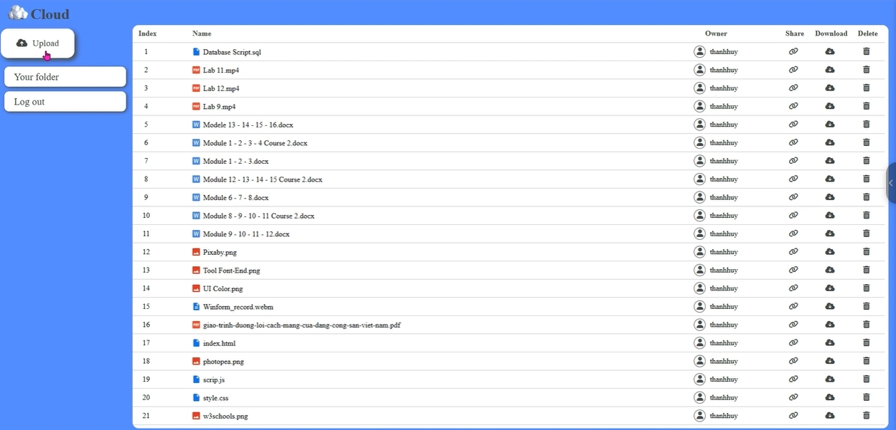

# Secure File Storage and Sharing Service

* Create a secure file storage and sharing service using S3 for storage.
* Implement encryption and identity management using AWS KMS (or your code) and IAM.
* Develop a front-end interface for users to upload and share files securely.

## Team members

* Nguyễn Thanh Huy - 21110473
* Nguyễn Thiện Luân - 21110538
* Hồ Phương Đông - 21110424

## Descriptions

### Storage service

* Use Key Manegement Service to create key encrypt and decrypt data.
* Use Cloudtrail to tracking and logging.
* Use Identity and Access Manegement to manage and assign permissions to users.
* Use S3 to storage.

### User interface

* User framework Flask create user interface.

## Installation and Running the Project

### Prerequisites

Before you begin, ensure you have met the following requirements:

* You have installed Python 3.6 or higher.
* You have an AWS account and have configured AWS CLI with appropriate access rights.
* Clone the repository to your local machine.

  ```bash
  git clone https://github.com/chickenHuy/Cloud.git
  ```
* To install the required libraries, navigate to the project directory and run:
  ```bash
  pip install -r requirements.txt
  ```
* To run the project, navigate to the project directory and run:
  ```bash
  flask run
  ```
* The application will start, and you can access it by navigating to http://127.0.0.1:5000/ in your web browser.

## The website overview
*Login page*


*Home page*



